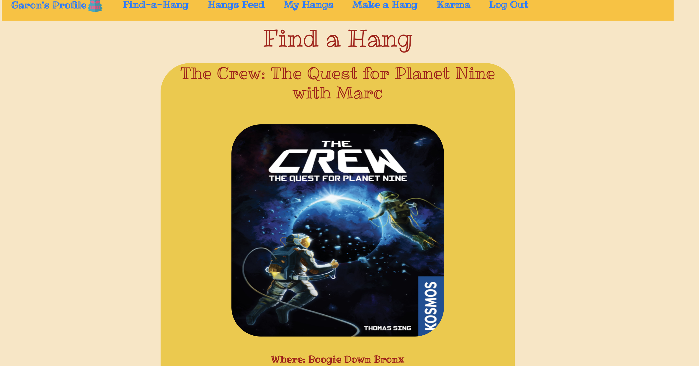

Welcome to Hangr! 

Hangr is a social interaction app in which users can create and search for local board game meet ups.
Installation:
- Fork and clone this repository
- "bundle install" if necessary 
- [Open Hangr Backend](https://github.com/gabechaz/hangr-backend)
- Run "rails db:migrate" & "rails db:seed"
- Run "rails s" in the terminal 
- Open the Hangr Frontend
- Run "npm start" 
Navigating the app:
- Sign Up/Log in
- If you are signing up for the first time, you can select your avatar by pressing the new avatar button until you find one that matches your style
- Find a Hang in your area by going to the Find-A-Hang tab in the navbar
- See info about hangs that you have signed up for by navigating to the My Hangs section of the navbar
- Create a Hang by going to the Make-A-Hang portion of the navbar, and searching for a game. Enter the rest of the logistical information and press Make Hang to add your Hang to the stack
- Review other users that you have had Hangs with by going to the Karma Page and leaving a review
- See reviews that other users have left for you by toggling the button at the top of the page
- View Hangs that other users have logged recently by going the Hangs Feed section of the navbar
- Log out by selecting the option in the navbar
Created by Gabriel Chazanov 